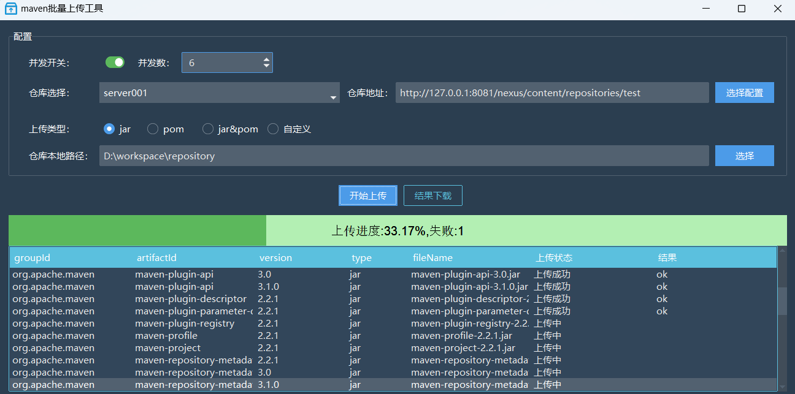

## Maven 批量上传工具 
### 介绍
window 桌面版maven批量上传私服工具
### 技术选型  
- 开发语言：python (3.12+)
- 运行依赖：JDK、Maven
### 界面  

### 功能说明
- 支持jar包批量上传到私服
- 支持pom文件批量上传到私服
- 支持jar和pom混合批量上传到私服
- 支持自定义上传到私服

### 安装启动
- 需要安装JDK环境
- 需要安装Maven环境
- 获取安装包，双击`maven 批量上传工具.exe`